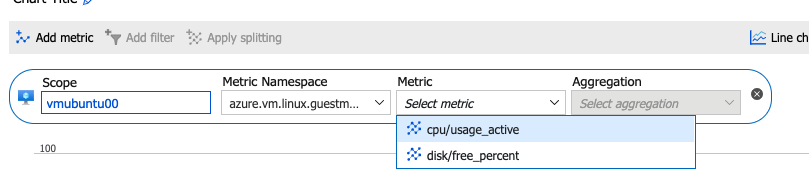
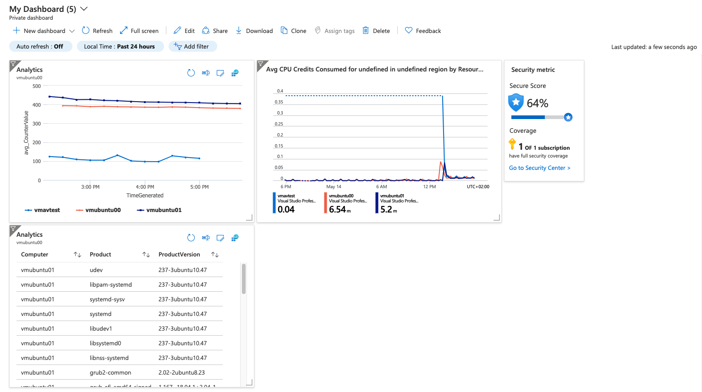

# TYDZIEN 3

## #TYDZIEN3.1

Po włączeniu Azure Defender (Security Center - standard), trzeba poczekać do godziny aby pojawiło się przestrzeganie wymagań np. PCI DSS w Security Center. Do tego czasu pojawiał się jedynie Azure Security Benchmark, który zdaje się jest dostępny w wersji Security Center - free. Nazewnictwo w Security Center nie jest wg. mnie spójne i gdzieniegdzie Azure mówi o włączaniu Azure Defender a gdzieniegdzie Security Center - standard, przy czym to jest ta sama usługa.

Zdecydowanie na plus możliwość wybiórczego włączenia usługi, tj. włączenia przykładowo usługi tylko dla wirtualnych maszyn, przez co można dokładniej kontrolować koszty.

## #TYDZIEN3.2

Domyślnie Azure pozwala na monitorowanie CPU, dysku i statusu. Monitorowanie większej ilości można włączyć na dwa sposoby: Insights (na konkretnym zasobie, bądź globalnie z Monitor -> Insights) i włączyć zbieranie większej ilość metryk (płacimy za dane skonsumowane i przechowywane), bądź Diagnostics -> Enable guest-level monitoring (wtedy trzeba aktywować przesyłanie metryk do Azure Monitor poprzez Sinks). Włączenie tej usługi na ubuntu powoduje wdrożenie rozszerzenia DependencyAgentLinux ([Azure Monitor Dependency virtual machine extension for Linux - Azure Virtual Machines | Microsoft Docs](https://docs.microsoft.com/en-us/azure/virtual-machines/extensions/agent-dependency-linux)). Azure posiada kilka różnych agentów i kilka z nich pokrywa się funkcjonalnością. Porównanie różnych agentów Azure-owych: [Overview of the Azure monitoring agents - Azure Monitor | Microsoft Docs](https://docs.microsoft.com/en-us/azure/azure-monitor/agents/agents-overview#supported-operating-systems). Azure zaraz po zainstalowaniu Dependency agenta na panelu Insights proponuje instalację nowszego agenta. Zgoda na upgrade powoduje instalację 2 kolejnych rozszerzeń: AgentMonitoringLinuxAgent i GuestHealthLinuxAgent. Nawet po instalacji agentów w Monitor -> Metrics nie jest możliwe dodanie memory.  Do wyboru mamy jedynie cpu i disk.



Memory możemy podejrzeć w Monitor -> Insights -> Virtual Machines. Dla maszyn Windowsowych memory jest dostępne z poziomu Metrics po włączeniu Insights.

Zbieranie eventów i metryk w ramach Log Analytics włączamy w Log Analytics Workspaces -> Agents Configuration. Możemy wybrać sobie jakie chcemy zapisywać eventy oraz metryki a później analizować dane z poziomu Monitor -> Logs. Zapytania wykonujemy w Kusto bądź SQL. ([kusto-queries/README.md at main · tobiasmcvey/kusto-queries · GitHub](https://github.com/tobiasmcvey/kusto-queries/blob/main/README.md#where)), [Getting started with Kusto | Microsoft Docs](https://docs.microsoft.com/en-us/azure/data-explorer/kusto/concepts/)[Kusto MS-TDS/T-SQL differences with SQL Server - Azure Data Explorer | Microsoft Docs](https://docs.microsoft.com/en-us/azure/data-explorer/kusto/api/tds/sqlknownissues), [Kusto 101 - A Jumpstart Guide to KQL | SquaredUp](https://squaredup.com/blog/kusto-101-a-jumpstart-guide-to-kql/#:~:text=KQL%20sounds%20like%20it's%20related,databases%20like%20Microsoft%20SQL%20Server.&text=Kusto%20databases%20do%20actually%20support%20SQL%20queries.), [SQL to Kusto query translation - Azure Data Explorer | Microsoft Docs](https://docs.microsoft.com/en-us/azure/data-explorer/kusto/query/sqlcheatsheet)

Kwerendy można później uzyc na Dashboard-ach poprzez użycie funkcji „Pin to dashboard”. Pozwala to na wrzucenie dowolnych danych które znajdują się w Log Analytics Workspace - wykresów jeśli chodzi o metryki, bądź logów. Przykładowo możemy wrzucić widget który pokaże nam wszystkie aktualizacje dostępne na maszynach linux:

``` c
Update 
| where UpdateState == "Needed" and OSType == "Linux" 
| summarize max(TimeGenerated) by Computer, Product, ProductVersion
| project Computer, Product, ProductVersion
```

Azure daje nam możliwość z korzystania predefiniowanych zapytań i wśród nich można znaleźć również inne zapytania dotyczące bezpieczeństwa. Przykładowo: wykrycie malware, błędne logowania do VM. Predefiniowane zapytania można filtrować na podstawie typu zasobu do którego mają zastosowanie.



## #TYDZIEN3.3

Po włączeniu Just-In-Time, Azure tworzy dla nas zasady w NSG, z domyślnym ustawieniem Deny i portami które wybraliśmy przy włączaniu JIT. Dostęp możemy aktywować z poziomu Security Center -> Azure Defender -> Just In Time, bądź bezpośrednio w poziomu panelu VM do której chcemy uzyskać dostęp. Wybieramy wtedy które porty chcemy otworzyć, na jaki IP i na jak długo. Dodatkowo, użytkownicy którzy chcą uzyskać dostęp do VMki muszą mieć dodane odpowiednie role w RBAC. [What exact permission is needed for a user to request JIT ? · Issue #40812 · MicrosoftDocs/azure-docs · GitHub](https://github.com/MicrosoftDocs/azure-docs/issues/40812)[Understanding just-in-time virtual machine access in Azure Security Center | Microsoft Docs](https://docs.microsoft.com/en-us/azure/security-center/just-in-time-explained#what-permissions-are-needed-to-configure-and-use-jit)

Azure Bastion \
++ łatwe włączenie usługi \
++ jeden bastion na cały vnet \
++ połączenia do VMek po wewnętrznym IP \
++ podobno działa na peerowanych vnetach, nawet pomiędzy subskrypcjami \
— tylko copy&pastę tekstu, brak wsparcia dla kopiowania plików \
— nie wspiera logowania do VMek przy użyciu Azure AD \
++/— dostępny z poziomu Azure Portal, nie obsługuje innych klientów

Po wdrożeniu Azure Bastion, nie mogłem uzyskać połączenia („The network connection to the Bastion Host appears unstable”). Natrafiłem na taki problem po raz pierwszy, ale wygląda na to że mogą pojawiać się problemy z usługą od czasu do czasu.
